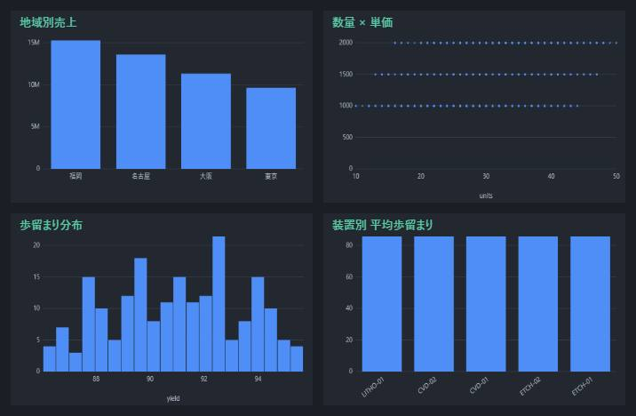

# Kohaku Studio

> データを磨き、洞察をかたちに。 — Rust-powered visual analytics.



**Kohaku Studio** は、Rust製の軽量なローカルファーストBIツールです。単一の実行ファイルがローカル
Webサーバーを起動し、既定のブラウザでUIを開きます。Node / WebView / .NET などの外部ランタイムに
一切依存せず、低スペックPCでも軽快に動くことを最優先に設計しています。

- 🗂 **CSV / Excel / SQLite / PostgreSQL / MySQL** を取り込み、共通の内部表形式に正規化
- 🔍 **SQL** ですべてのデータを横断集計（ソースの異なるデータ同士もJOIN可能）
- 📊 **チャート**（棒 / 折れ線 / 散布図 / ヒストグラム / テーブル）を自前Canvasレンダラで描画
- 📈 **分析**（データプロファイル / 回帰分析 / クラスタリング）を純Rustで実装
- 💾 **プロジェクト**（データソース定義・チャート・クエリ履歴）を `.kohaku` ファイルに保存
- 🔒 完全ローカル処理（`127.0.0.1`）。データの外部送信なし

---

## クイックスタート

### ビルド

[Rust ツールチェーン](https://rustup.rs/)（stable）が必要です。

```bash
cargo build --release
```

生成された実行ファイルを起動します（Windowsの例）:

```bash
./target/release/kohaku-studio        # ブラウザが自動で開く
```

### 実行時オプション

```
kohaku-studio                       起動（ブラウザが自動で開く、既定ポート 5590）
kohaku-studio --port 8080           ポート指定（使用中なら自動で次を探す）
kohaku-studio --no-browser          ブラウザを開かない
kohaku-studio --make-samples DIR    動作確認用サンプルデータ（CSV / SQLite DB）を生成
```

終了はコンソールウィンドウを閉じるか `Ctrl+C`。

### まず試す

```bash
kohaku-studio --make-samples ./samples   # サンプルデータを生成
kohaku-studio                            # 起動して ./samples のファイルをインポート
```

---

## 使い方

1. **＋ インポート** — 「ファイル」タブで CSV / Excel / SQLite DB を選択、または
   「データベース」タブで PostgreSQL / MySQL の接続URLを入力
   → シート・テーブル選択、ヘッダー行指定、型推定プレビューを確認して取り込み
2. **SQLタブ** — 取り込んだデータセットはすべてSQLのテーブルとして参照可能。
   ソースが違うデータ同士（例: Excel × DB）もJOINできる。`Ctrl+Enter` で実行
3. **チャートタブ** — 棒 / 折れ線 / 散布図 / ヒストグラム / テーブル。
   データセットまたはSQL結果をソースに、X列・Y列・集計（合計/平均/件数/最小/最大）を指定
4. **分析タブ** — データプロファイル・回帰分析・クラスタリング（下記）
5. **ダッシュボードタブ** — 保存済みチャートを一覧表示
6. **保存 / 開く** — プロジェクトを `.kohaku` ファイル（中身はJSON）に保存・復元
   （データ本体は含まず、元のソースファイルから再読み込みする）

---

## 対応データソース

| 形式 | 拡張子 | 備考 |
| --- | --- | --- |
| CSV | `.csv` `.tsv` `.txt` | UTF-8 / Shift-JIS 自動判別、区切り文字自動推定 |
| Excel | `.xlsx` `.xlsm` `.xlsb` `.xls` `.ods` | シート選択、ヘッダー行指定、日付シリアル値→ISO文字列、数式は計算済み値 |
| SQLite | `.db` `.sqlite` `.sqlite3` `.db3` | テーブル/ビュー一覧から選択（読み取り専用で開く） |

---

## 分析機能

外部ライブラリなしの純Rust実装（`bi-analytics` クレート）。ソースはデータセットまたは任意のSQL結果を選べます。

| 機能 | 内容 |
| --- | --- |
| データプロファイル | 全列の統計量（件数/NULL/個別値/平均/標準偏差/四分位）、数値列間のピアソン相関行列、相関の強いペアの自動抽出をワンクリックで実行 |
| 回帰分析 | 単回帰・重回帰（OLS）。係数・標準誤差・t値・R²・調整済みR²・RMSE・回帰式を表示。単回帰はフィット直線付き散布図、重回帰は実測vs予測プロット |
| クラスタリング | k-means++（特徴量は自動でz-score標準化、シード固定で再現可能）。クラスタ中心・件数の表示、任意の2軸での色分け散布図。結果は cluster 列付きの新データセットとして保存でき、SQL/チャートでそのまま利用可能 |

- 欠損値（NULL）を含む行は自動除外され、除外件数が表示される
- 大規模データでも k-means は学習を最大2万点のサンプルで行うため数秒で完了（全行への割り当ては厳密に実施）
- 完全な多重共線性など数値的に解けないケースはエラーで通知

---

## アーキテクチャ

```
ブラウザUI (vanilla JS + Canvas)  ──JSON API──▶  Rust コア
```

| クレート | 責務 |
| --- | --- |
| `bi-core` | データモデル・Connector trait・Projectモデル |
| `bi-connectors` | CSV / Excel(calamine) / SQLite コネクタ |
| `bi-analytics` | 統計・回帰・クラスタリング（純Rust・依存なし） |
| `bi-app` | HTTPサーバー・クエリエンジン・分析API・内蔵UI |

データフロー、設計原則、拡張方法（新しいデータソース／チャートの追加）、技術選定の詳細は
**[docs/architecture.md](docs/architecture.md)** を参照してください。

---

## セキュリティ

APIエンドポイント（`/api/*`）にはローカルCSRF対策として、次のガードがあります:

1. POSTメソッドのみ許可
2. `Content-Type: application/json` を必須（プリフライトを回避する単純リクエストを排除）
3. ブラウザ由来（`Origin` ヘッダあり）のリクエストは `localhost` / `127.0.0.1` のみ許可

これにより、ツール起動中に別のWebページをブラウザで開いても、そのページからローカルAPIを
勝手に叩かれる（ファイル書き込み・SQL実行など）ことを防ぎます。

---

## テスト

```bash
cargo test
```

コネクタ（CSV/Shift-JIS判定・Excel日付変換・SQLite）、クエリエンジン、型推定、
統計・回帰・クラスタリングのユニットテストが含まれます。

---

## 性能の目安（参考値）

一般的なノートPCでの目安です（環境により変動します）:

- 実行ファイル: 約3MB、外部依存なし
- メモリ: 起動時 約10MB / 30万行（約7MBのCSV）ロード後 約20〜30MB
- 30万行CSVのインポート: 数秒、フィルタ集計: 数十ミリ秒
- よく使う列でのGROUP BYが遅い場合は、SQLタブで `CREATE INDEX idx_name ON table(col)` を
  実行すると高速化できる（インデックスもin-memoryに作られる）

---

## 制限事項

- インポート上限は200万行（在メモリ処理のため）。プレビューは先頭50行
- SQL結果の表示は2,000行まで（集計してから表示する想定）
- セル結合を含むExcelは結合セルの左上以外が空値になる
- プロジェクトファイルはデータ本体を含まない。元ファイルを移動すると再読み込みに失敗する
- クラスタリング結果の派生データセットはプロジェクト保存の対象外（再読み込み時に分析を再実行する）

---

## ビルドに関する注意（Windows）

一部のWindows環境では、「ドキュメント」フォルダ配下に作られたディレクトリに ReadOnly 属性が
自動付与され、`autocfg` 系のビルドスクリプトがビルドに失敗することがあります。その場合は
[`.cargo/config.toml.example`](.cargo/config.toml.example) を参考に `.cargo/config.toml` を作成し、
`target-dir` をドキュメント外（例: `LocalAppData`）へ逃がしてください。通常の環境では不要です。

---

## ロードマップ

今後の開発計画は [ROADMAP.md](ROADMAP.md) を参照してください。

---

## ライセンス

[MIT](LICENSE-MIT) または [Apache-2.0](LICENSE-APACHE) のデュアルライセンスです。
いずれかを選択して利用できます。
